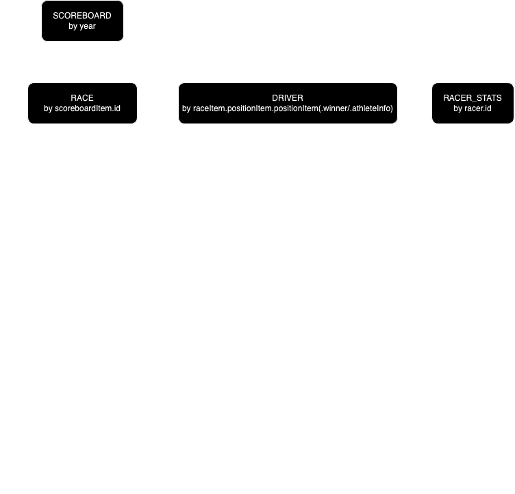

### F1-BACKEND
This is a partial Backend For Frontend for demonstration purposes.

The idea is to provide a more straightforward API to the FE to be consumed,
and to abstract the logic so that it is possible to switch API without major disruptions on the FE.
Ideally this BFF should be attached to a caching system to avoid multiple calls fetching data that are
immutable due to their nature (events that already happened are not going to change).
This would also help reducing costs if the API used was priced per call.

### Tech Stack
Express, TS, Axios

## Launch
```npm run start``` or ```npm run dockerun```


